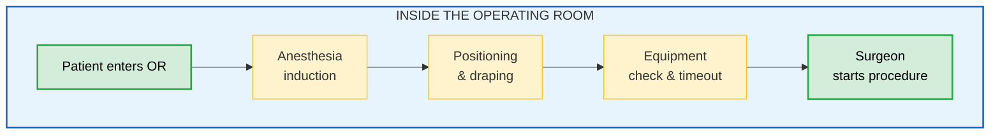
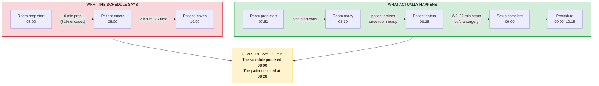
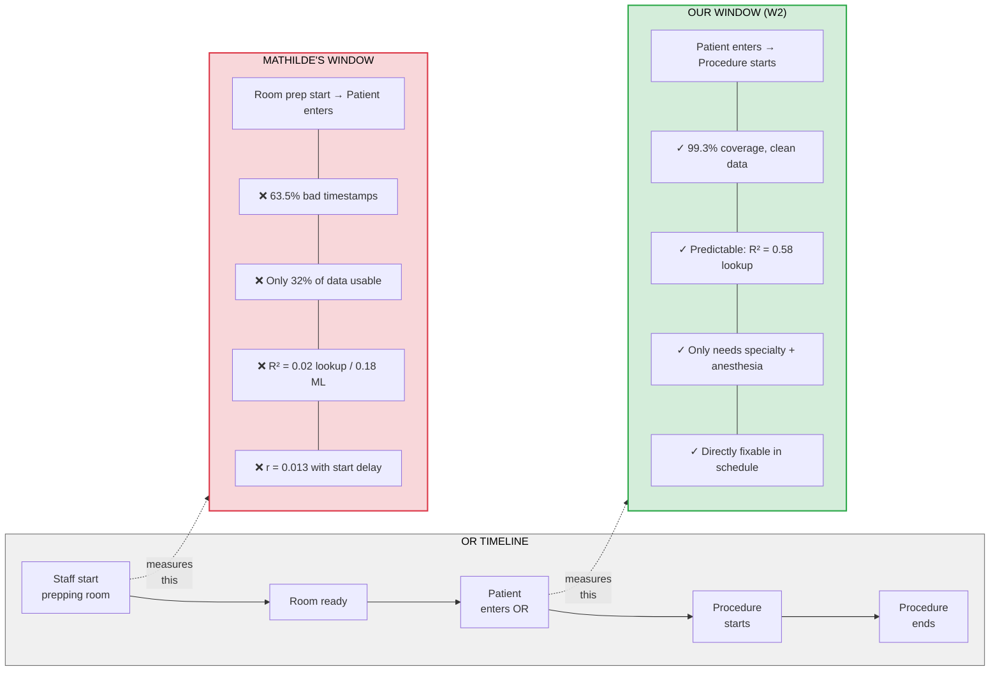
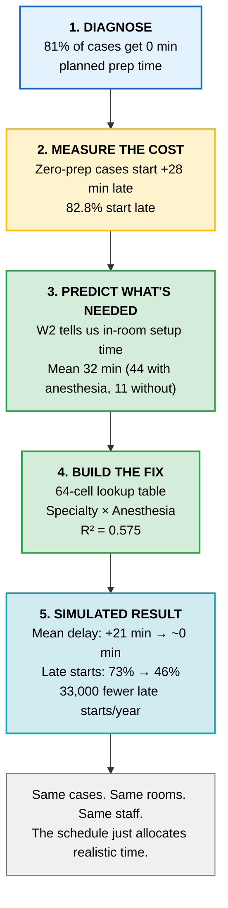
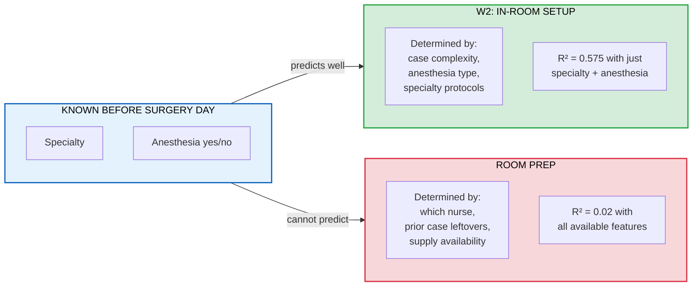

# W2 Explainer — What It Measures, Why It Matters, How To Use It

## What W2 measures



```
W2 = ts_procedure_start − ts_patient_in_or

Mean: 32 min  |  With anesthesia: 44 min  |  Without: 11 min
Coverage: 99.3%  |  Data quality issues: none
```

---

## The scheduling problem W2 exposes



---

## W2 vs Mathilde's room prep window



---

## From analysis to action



---

## Why W2 is predictable and room prep is not


