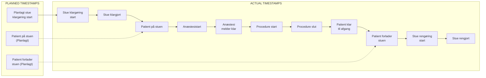
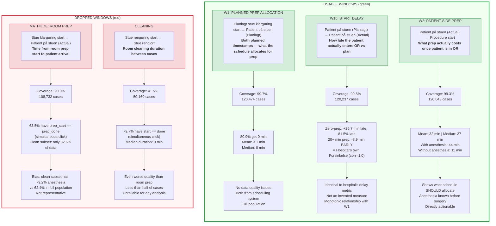
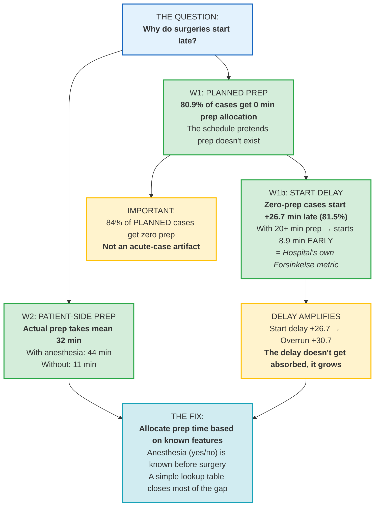

# OR Timeline — Analysis Windows

## Full OR Timeline (chronological)

## The Windows

```mermaid
graph TB
    subgraph TIMELINE["OR TIMELINE (left to right = chronological)"]
        direction LR
        T1["Planlagt stue<br/>klargøring start<br/><i>99.7%</i>"]
        T2["Patient på stuen<br/>(Planlagt)<br/><i>99.7%</i>"]
        T3["Patient på stuen<br/>(Actual)<br/><i>99.6%</i>"]
        T4["Procedure start<br/><i>99.4%</i>"]
        T5["Procedure slut<br/><i>99.4%</i>"]
        T6["Patient forlader<br/>stuen<br/><i>99.6%</i>"]

        T1 --> T2 --> T3 --> T4 --> T5 --> T6
    end

    subgraph W1["W1: PLANNED PREP ALLOCATION"]
        direction LR
        W1a["Planlagt stue klargøring start"]
        W1b["Patient på stuen (Planlagt)"]
        W1a -->|"planned_prep_min"| W1b
    end

    subgraph W1D["W1b: START DELAY"]
        direction LR
        W1Da["Patient på stuen (Planlagt)"]
        W1Db["Patient på stuen (Actual)"]
        W1Da -->|"start_delay_min"| W1Db
    end

    subgraph W2["W2: PATIENT-SIDE PREP"]
        direction LR
        W2a["Patient på stuen (Actual)"]
        W2b["Procedure start"]
        W2a -->|"patient_prep_min"| W2b
    end

    subgraph MATH["MATHILDE'S WINDOW (DROPPED)"]
        direction LR
        Ma["Stue klargøring start"]
        Mb["Patient på stuen (Actual)"]
        Ma -->|"room_prep_min"| Mb
    end

    subgraph CLEAN["CLEANING (DROPPED)"]
        direction LR
        Ca["Stue rengøring start"]
        Cb["Stue rengjort"]
        Ca -->|"cleaning_min"| Cb
    end

    style W1 fill:#d4edda,stroke:#28a745,stroke-width:2px
    style W1D fill:#d4edda,stroke:#28a745,stroke-width:2px
    style W2 fill:#d4edda,stroke:#28a745,stroke-width:2px
    style MATH fill:#f8d7da,stroke:#dc3545,stroke-width:2px
    style CLEAN fill:#f8d7da,stroke:#dc3545,stroke-width:2px
```

## Window Comparison

## How the Three Good Windows Tell the Story

## Quick Reference

| Window | Formula | Coverage | Quality | Role |
|--------|---------|----------|---------|------|
| **W1** | `Patient på stuen (Planlagt)` - `Planlagt stue klargøring start` | 99.7% | Clean | Root cause: schedule allocates no prep |
| **W1b** | `Patient på stuen` - `Patient på stuen (Planlagt)` | 99.5% | Clean, = Forsinkelse | Consequence: cases start late |
| **W2** | `Procedure start` - `Patient på stuen` | 99.3% | Clean | What prep actually costs |
| ~~Mathilde~~ | `Stue klargøring start` → `Patient på stuen` | 90.0% | 63.5% simultaneous click | Dropped — biased subset |
| ~~Cleaning~~ | `Stue rengøring start` → `Stue rengjort` | 41.5% | 79.7% simultaneous click | Dropped — unusable |
